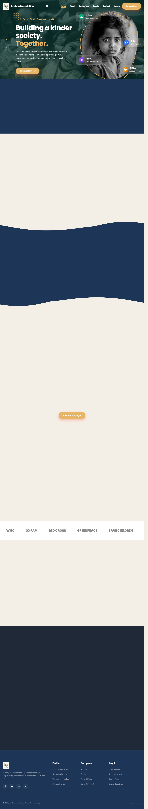
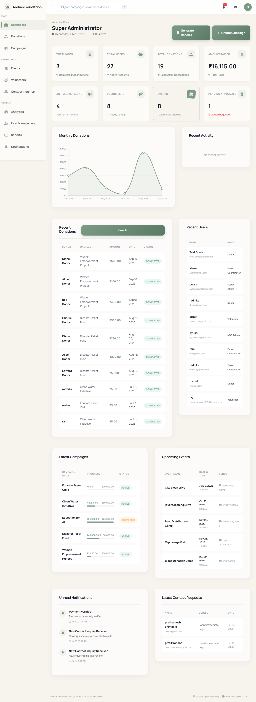
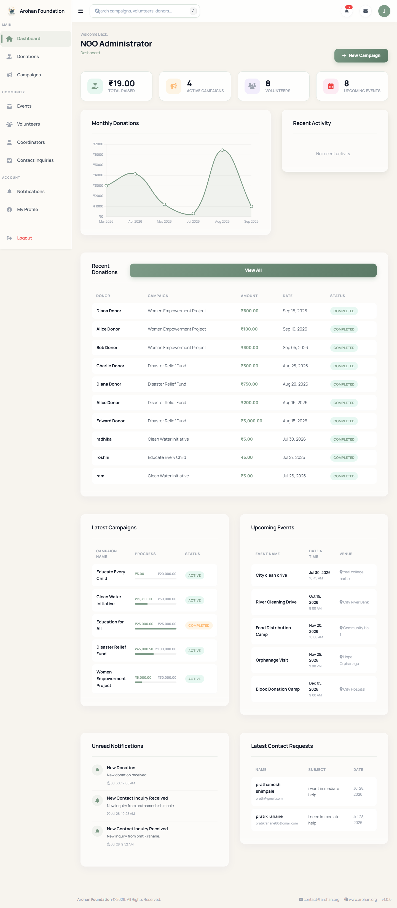
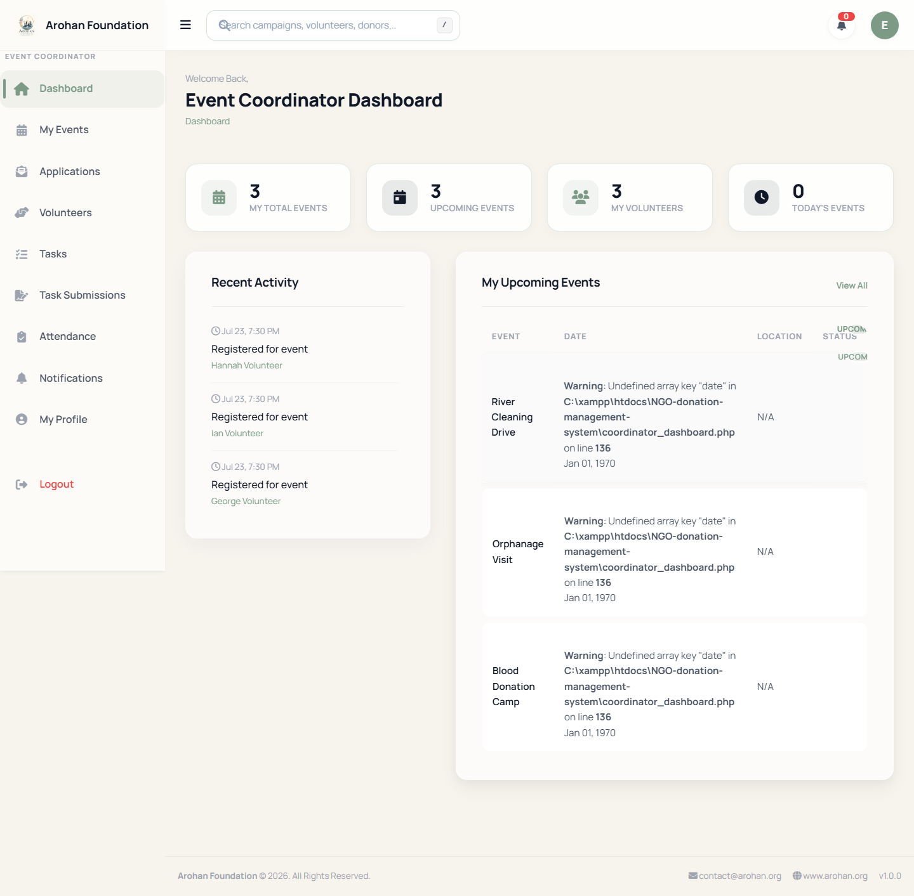
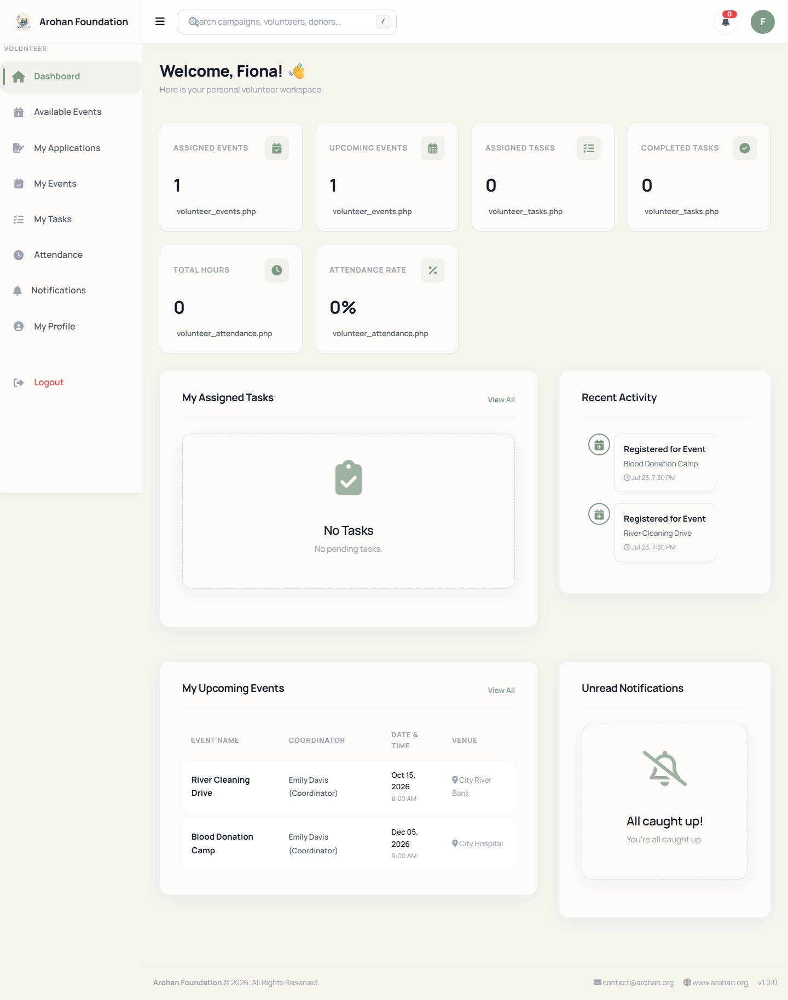
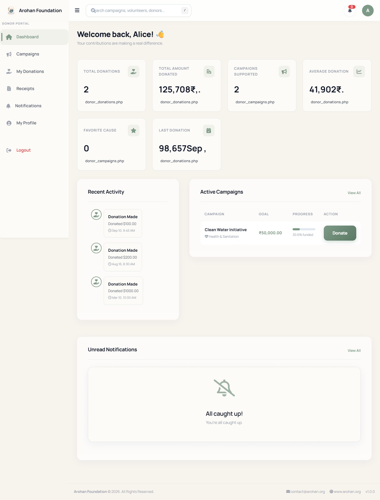

# Arohan Foundation — Enterprise-Grade NGO Management System

Arohan Foundation is a comprehensive, multi-tenant web application designed to streamline NGO operations. Instead of relying on disparate tools, this system unifies donation tracking, volunteer management, event coordination, and administrative reporting into a single, cohesive platform.

Built with a focus on raw performance, security, and scalability using Core PHP and MySQL.

---

## 🏗 Architecture & Engineering

- **Role-Based Access Control (RBAC)**: Deeply integrated permission system supporting 5 distinct user roles (Super Admin, NGO Admin, Coordinator, Volunteer, Donor) with isolated dashboard views and restricted API endpoints.
- **Security First**: Comprehensive protection against SQL Injection, XSS, and CSRF vulnerabilities using PDO prepared statements, output sanitization, and strict session management.
- **Custom MVC Pattern**: Engineered a bespoke Model-View-Controller architecture without heavy frameworks to ensure optimal performance and complete control over the request lifecycle.
- **Responsive UI/UX**: Designed a premium, accessible interface using Vanilla CSS and JavaScript, minimizing reliance on heavy third-party libraries for lightning-fast page loads.

## ✨ Key Features

- **Centralized Dashboard & Analytics**: Real-time insights into donation metrics, volunteer attendance, and campaign progress.
- **Donation Tracking & Receipt Generation**: Automated workflow from payment processing (Razorpay integration ready) to customizable PDF receipt generation.
- **Event & Task Management**: Coordinators can create events, assign tasks to volunteers, track attendance, and manage applications seamlessly.
- **Inquiry & Notification System**: Built-in messaging and real-time notification engine keeping all stakeholders updated on critical actions.

---

## 🚀 Quick Start

### 1. Clone the repository
```bash
git clone https://github.com/pratikrahane01/NGO-Donation-and-Volunteer-Management-System.git
cd NGO-Donation-and-Volunteer-Management-System
```

### 2. Configure Environment
Ensure you have **XAMPP** (PHP 8.x + MySQL) installed.
Move the project folder into your XAMPP `htdocs` directory.

### 3. Database Setup
Start Apache and MySQL from the XAMPP Control Panel.
```bash
# Navigate to phpMyAdmin: http://localhost/phpmyadmin
# 1. Create a database named `ngo_management`
# 2. Import the schema file located at: database/schema.sql
# 3. (Optional) Import dummy data from: database/sample_data.sql
```

### 4. Application Configuration
Verify the database credentials in `config/database.php`:
```php
define('DB_HOST', 'localhost');
define('DB_USER', 'root');
define('DB_PASS', '');
define('DB_NAME', 'ngo_management');
```

### 5. Launch
Open your browser and navigate to:
`http://localhost/NGO-Donation-and-Volunteer-Management-System/`

---

## 📂 Project Structure

- **`api/`** — API endpoints handling asynchronous AJAX requests.
- **`assets/`** — Static assets (CSS, JS, optimized imagery).
- **`config/`** — Core configuration files and environment settings.
- **`core/`** — Foundation classes (Session handling, Database wrappers, Security).
- **`database/`** — SQL schemas and migration scripts.
- **`includes/`** — Reusable UI components and layouts.
- **`modules/`** — Domain-specific logic (Donations, Volunteers, Events).
- **`vendor/`** — Composer dependencies.

---

## 🔮 Roadmap

- [ ] **Payment Gateway**: Finalizing Razorpay integration for live transactions.
- [ ] **Email Engine**: Implementing SMTP/SendGrid for automated donor receipts.
- [ ] **Advanced Analytics**: Interactive charting using Chart.js for data visualization.
- [ ] **RESTful API**: Exposing core services for mobile application consumption.

---

## 🖼️ System Visuals

**Landing Page**


**Super Admin Dashboard**


**NGO Admin Dashboard**


**Coordinator Dashboard**


**Volunteer Dashboard**


**Donor Dashboard**

