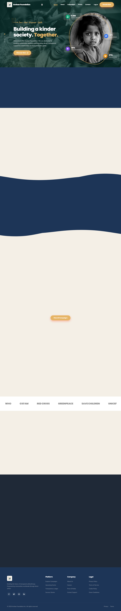

# NGO Donation & Volunteer Management System

## Project Description
A comprehensive, scalable platform to manage NGO donations, track volunteers, coordinate events, and generate insightful reports. Designed to streamline operations for super admins, NGO admins, donors, volunteers, and event coordinators.

## Technology Stack
- **Frontend**: HTML5, CSS3, Vanilla JavaScript
- **Backend**: Core PHP
- **Database**: MySQL
- **Server**: XAMPP
- **Authentication**: PHP Sessions

## Folder Structure
```
NGO-Donation-Management-System/
├── api/             # API endpoints for ajax requests
├── assets/          # Static files (CSS, JS, Images, Fonts)
├── config/          # Application and database configuration
├── database/        # SQL schemas and sample data
├── includes/        # Reusable template parts and utilities
├── logs/            # Application log files
├── migrations/      # Database migration scripts
├── modules/         # Core application features
├── notifications/   # System notifications module
├── reports/         # Reporting module
├── settings/        # System settings module
├── uploads/         # User uploaded files
├── users/           # User role specific dashboards/logic
├── vendor/          # Third-party dependencies (composer)
├── composer.json    # Project metadata
├── index.php        # Application entry point
└── README.md        # Project documentation
```

## Requirements
- XAMPP with PHP 8.x and MySQL
- Any modern web browser

## Installation Instructions & How to Run Using XAMPP
1. Download or clone this repository.
2. Copy the `NGO-Donation-Management-System` folder to your XAMPP `htdocs` directory (e.g., `C:\xampp\htdocs\`).
3. Start **Apache** and **MySQL** modules from the XAMPP Control Panel.
4. Open your browser and navigate to `http://localhost/phpmyadmin`.
5. Create a new database named `ngo_management`.
6. Import the `database/schema.sql` file into the newly created database.
7. (Optional) Import `database/sample_data.sql` for dummy data.
8. Update the database credentials in `config/database.php` if necessary.
9. Open your browser and navigate to `http://localhost/NGO-Donation-Management-System/` to access the application.

## Future Modules
- Payment Gateway Integration
- Email Notifications
- Advanced Analytics Dashboard
- Mobile App API

## System Visuals

### Landing Page


### User Dashboards

**Super Admin Dashboard**


**NGO Admin Dashboard**


**Coordinator Dashboard**


**Volunteer Dashboard**


**Donor Dashboard**

